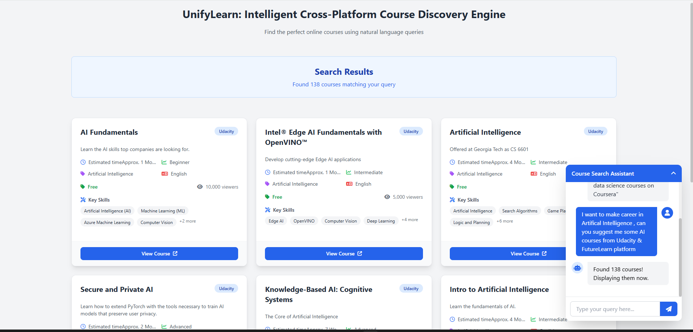

# UnifyLearn: Intelligent Cross-Platform Course Discovery Engine



An AI-powered intelligent search and unification system that understands natural language queries, searches across multiple online learning platforms simultaneously, and returns enriched, standardized course information with automatically completed metadata, skill extraction, and contextual understanding for comprehensive learning discovery.

## 🚀 Features

- **Natural Language Processing**: Understands conversational queries like "Show me Python courses for beginners"
- **Multi-Platform Search**: Simultaneously searches across Coursera, Udemy, and other learning platforms
- **Intelligent Data Enrichment**: Uses LLM to automatically complete missing course information
- **Standardized Schema**: Presents results in a consistent format regardless of source platform
- **Real-time Results**: Fast, responsive search with comprehensive course details
- **Beautiful UI**: Modern, card-based interface with 3-column responsive layout

## 📁 Project Structure

```
Project/
├── Backend/                 # Python Flask API
│   ├── .env                # Environment variables
│   ├── requirements.txt    # Python dependencies
│   ├── results/            # Query results storage
│   └── src/
│       └── app/
│           ├── main.py              # Flask app entry point
│           ├── routes.py            # API endpoint definitions
│           ├── query_handler.py     # Main query processing orchestrator
│           ├── schema_loader.py     # Schema definitions and sample data
│           ├── db_connection.py     # MongoDB connection setup
│           ├── response_formatter.py # Data standardization
│           ├── universal_schema.py  # Standard course format definition
│           ├── utils.py             # Utility functions
│           ├── data_enrichment/     # Data standardization & enrichment
│           │   ├── __init__.py
│           │   ├── llm_enricher.py  # LLM-based data completion
│           │   └── uniform_formatter.py # Universal schema formatting
│           ├── query_generator/     # Query generation module
│           │   ├── __init__.py
│           │   ├── llm_query_builder.py # LLM query generation
│           │   └── query_translator.py # Field name mapping
│           ├── query_executor/      # Query execution module
│           │   ├── __init__.py
│           │   └── provider_executor.py # MongoDB query execution
│           └── results/             # Results handling
│               ├── __init__.py
│               └── saver.py         # Result persistence
│
├── Frontend/                # Node.js Express frontend
│   ├── app.js              # Express server
│   ├── package.json        # Node.js dependencies
│   ├── .env                # Frontend environment variables
│   ├── views/              # EJS templates
│   │   ├── index.ejs       # Main homepage
│   │   └── partials/       # Template partials
│   │       ├── header.ejs
│   │       ├── footer.ejs
│   │       ├── chatbot.ejs
│   │       └── course-card.ejs # Course display template
│   ├── public/             # Static assets
│   │   ├── css/
│   │   │   └── style.css   # Custom styles
│   │   ├── js/
|   │   │   ├── chatbot.js        # chatbot toggle, sendMessage, addMessage
|   │   │   ├── courseCard.js     # card rendering (only handles HTML of 1 course card)
|   │   │   ├── results.js        # updateCourseResults (loops + uses courseCard.js)
|   │   │   └── main.js
│   │   └── assets/         # Images and other assets
│   └── routes/
│       └── index.js        # API route handlers
│
└── README.md               # This documentation
```

## 🛠️ Technologies Used

### Backend

- **Python 3.8+**: Core programming language
- **Flask**: Web framework for API development
- **MongoDB**: NoSQL database for course storage
- **LLM (OpenAI GPT)**: Natural language processing and data enrichment
- **Pymongo**: MongoDB Python driver
- **Python-dotenv**: Environment variable management

### Frontend

- **Node.js**: JavaScript runtime environment
- **Express.js**: Web application framework
- **EJS**: Embedded JavaScript templating
- **Axios**: HTTP client for API requests
- **Tailwind CSS**: Utility-first CSS framework
- **Font Awesome**: Icon library

## 📋 Installation & Setup

### Prerequisites

- Python 3.8 or higher
- Node.js 14 or higher
- MongoDB database
- OpenAI API key

### Backend Setup

1. **Navigate to Backend directory**:

   ```bash
   cd Backend
   ```

2. **Install Python dependencies**:

   - Create a python venv named any thing `IIABackend` andf actiavte it

   ```bash
   pip install -r requirements.txt
   ```

3. **Set up environment variables**:
   Create a `.env` file in the Backend directory:

```bash
# MongoDB - Full connection string (update username, password, and cluster details)
MONGO_URI="mongodb+srv://<USERNAME>:<PASSWORD>@<CLUSTER_URL>/?retryWrites=true&w=majority&appName=<APP_NAME>"

# Coursera Cluster
MONGO_URI_COURSERA="mongodb+srv://<USERNAME>:<PASSWORD>@<CLUSTER_URL>/?retryWrites=true&w=majority&appName=<APP_NAME>"
MONGO_DB_COURSERA="CourseraDB"
MONGO_USER_COURSERA="<USERNAME>"
MONGO_PASSWORD_COURSERA="<PASSWORD>"
ATLAS_COURSERA_CONNECTION_STR="mongodb+srv://<USERNAME>:<PASSWORD>@<CLUSTER_URL>/"

# Udacity Cluster
MONGO_URI_UDACITY="mongodb+srv://<USERNAME>:<PASSWORD>@<CLUSTER_URL>/?retryWrites=true&w=majority&appName=<APP_NAME>"
MONGO_DB_UDACITY="UdacityDB"
MONGO_USER_UDACITY="<USERNAME>"
MONGO_PASSWORD_UDACITY="<PASSWORD>"
ATLAS_UDACITY_CONNECTION_STR="mongodb+srv://<USERNAME>:<PASSWORD>@<CLUSTER_URL>/"

# Simplilearn Cluster
MONGO_URI_SIMPLILEARN="mongodb+srv://<USERNAME>:<PASSWORD>@<CLUSTER_URL>/?retryWrites=true&w=majority&appName=<APP_NAME>"
MONGO_DB_SIMPLILEARN="SimpliLearnDB"
MONGO_USER_SIMPLILEARN="<USERNAME>"
MONGO_PASSWORD_SIMPLILEARN="<PASSWORD>"
ATLAS_SIMPLILEARN_CONNECTION_STR="mongodb+srv://<USERNAME>:<PASSWORD>@<CLUSTER_URL>/"

# FutureLearn Cluster
MONGO_URI_FUTURELEARN="mongodb+srv://<USERNAME>:<PASSWORD>@<CLUSTER_URL>/?retryWrites=true&w=majority&appName=<APP_NAME>"
MONGO_DB_FUTURELEARN="FutureLearnDB"
MONGO_USER_FUTURELEARN="<USERNAME>"
MONGO_PASSWORD_FUTURELEARN="<PASSWORD>"
ATLAS_FUTURELEARN_CONNECTION_STR="mongodb+srv://<USERNAME>:<PASSWORD>@<CLUSTER_URL>/"

# Collection names (remain same)
MONGO_COLLECTION_COURSERA="Coursera"
MONGO_COLLECTION_UDACITY="Udacity"
MONGO_COLLECTION_SIMPLILEARN="SimpliLearn"
MONGO_COLLECTION_FUTURELEARN="FutureLearn"

# Output / logging
OUTPUT_DIR="./results"
LOG_LEVEL="INFO"

# LLM (Gemini API Key)
# GEMINI_API_KEY="<YOUR_GEMINI_API_KEY>"

GEMINI_API_KEY="<YOUR_GEMINI_API_KEY>"

# Flask
FLASK_APP="src/app/main.py"
FLASK_ENV="development"
SECRET_KEY="<YOUR_SECRET_KEY>"

```

4. **Run the backend server**:

```bash
python Backend/run.py
```

The backend will start on `http://localhost:5000`

### Frontend Setup

1. **Navigate to Frontend directory**:

   ```bash
   cd Frontend
   ```

2. **Install Node.js dependencies**:

   ```bash
   npm install
   ```

3. **Set up environment variables**:
   Create a `.env` file in the Frontend directory:

   ```env
   PORT=3000
   BACKEND_URL=http://localhost:5000
   ```

4. **Run the frontend server**:

- Before install this dependencies

```bash
  "dependencies": {
    "axios": "^1.11.0",
    "dotenv": "^16.6.1",
    "ejs": "^3.1.10",
    "express": "^4.21.2"
  },
  "devDependencies": {
    "nodemon": "^3.1.10"
  }
```

- There after run `npm start` or `nodemon app.js`

The frontend will start on `http://localhost:3000`

## 🚀 Running the Application

1. **Start MongoDB service** (if running locally)
2. **Start the backend server**:
   ```bash
   cd Backend
   python run.py
   ```
3. **Start the frontend server** (in a new terminal):
   ```bash
   cd Frontend
   npm start
   ```
4. **Open your browser** and navigate to `http://localhost:3000`

## 📡 API Endpoints

### Backend Routes (`http://localhost:5000`)

| Endpoint                          | Method | Description                      | Parameters                              |
| --------------------------------- | ------ | -------------------------------- | --------------------------------------- |
| `/health`                         | GET    | Health check                     | None                                    |
| `/query`                          | POST   | Process natural language query   | `{"query": "search terms"}`             |
| `/results`                        | GET    | List all timestamp directories   | None                                    |
| `/results/<timestamp>`            | GET    | Get polished results for a query | `timestamp` path parameter              |
| `/results/<timestamp>/files`      | GET    | List all files in a directory    | `timestamp` path parameter              |
| `/results/<timestamp>/<filename>` | GET    | Download specific JSON file      | `timestamp`, `filename` path parameters |

### Frontend Routes (`http://localhost:3000`)

| Endpoint              | Method | Description                    |
| --------------------- | ------ | ------------------------------ |
| `/`                   | GET    | Homepage with search interface |
| `/query`              | POST   | Forward query to backend API   |
| `/test-backend`       | GET    | Test backend connectivity      |
| `/results/:timestamp` | GET    | Get saved results by timestamp |

## 🔧 How It Works

### Backend Architecture

1. **Query Processing Pipeline**:

   - User submits natural language query
   - LLM analyzes query and generates MongoDB queries
   - System executes queries across multiple database collections
   - Results are standardized into universal schema format
   - LLM enriches data by filling missing fields
   - Final results are saved and returned to frontend

2. **Key Backend Functions**:
   - `processUserQuery()` (query_handler.py) - Main orchestrator
   - `generate_queries()` (llm_query_builder.py) - Converts NL to DB queries
   - `execute_provider_query()` (provider_executor.py) - Runs database queries
   - `format_to_universal_schema()` (uniform_formatter.py) - Standardizes data
   - `enrich_course_data()` (llm_enricher.py) - Completes missing information
   - `save_results()` (saver.py) - Persists query results

### Frontend Architecture

1. **User Interaction Flow**:

   - User enters query in chatbot interface
   - Frontend sends query to backend API
   - Displays loading state with progress indication
   - Renders results in beautiful 3-column card layout
   - Provides smooth scrolling and responsive design

2. **Key Frontend Functions**:
   - `sendMessage()` (script.js) - Handles user queries
   - `updateCourseResults()` (script.js) - Renders course cards
   - Route handlers (index.js) - Manage API communication

## 💡 Example Queries

Try these natural language queries:

- "Show me Python courses for beginners"
- "Find data science courses with certificates"
- "Recommend machine learning courses on Coursera"
- "NLP or natural language processing courses from any platform"
- "Show me the top 5 deep learning courses"

## 📊 Sample Response Format

```json
{
  "title": "Introduction to Data Science Specialization",
  "url": "https://www.coursera.org/specializations/introduction-data-science",
  "description": "Launch your career in data science...",
  "category": "Data Science",
  "language": "English",
  "skills": ["Data Science", "Python", "SQL", "Machine Learning"],
  "instructors": ["Instructor 1", "Instructor 2"],
  "duration": "Approximately 5 months to complete",
  "site": "Coursera",
  "level": "Specialization",
  "viewers": 11927,
  "prerequisites": "Basic computer literacy and math skills",
  "learning_outcomes": "Gain foundational data science skills...",
  "price": "Subscription-based pricing",
  "provider": "Coursera"
}
```


## 🧪 Testing

### Backend Testing

```bash
cd Backend
python -m pytest src/tests/ -v
```

### API Testing

Test the backend API directly:

```bash
curl -X POST http://localhost:5000/query \
  -H "Content-Type: application/json" \
  -d '{"query": "Show me Python courses"}'
```

### Frontend Testing

Open your browser to `http://localhost:3000/test-backend` to verify backend connectivity.

## 🔮 Future Enhancements

- Add more learning platforms (Udemy, edX, etc.)
- User authentication and saved searches
- Advanced filtering and sorting options
- Course comparison functionality
- Personalized recommendations
- Rating and review integration
- Price tracking and alerts

## 🤝 Contributing

1. Fork the repository
2. Create a feature branch (`git checkout -b feature/amazing-feature`)
3. Commit your changes (`git commit -m 'Add amazing feature'`)
4. Push to the branch (`git push origin feature/amazing-feature`)
5. Open a Pull Request

## 📄 License

This project is licensed under the MIT License - see the LICENSE file for details.

## 🆘 Support

If you encounter any issues or have questions:

1. Check the troubleshooting section below
2. Ensure all environment variables are properly set
3. Verify MongoDB is running and accessible
4. Confirm your OpenAI API key is valid

## 🐛 Troubleshooting

### Common Issues

1. **Backend connection refused**:

   - Ensure backend is running on port 5000
   - Check `BACKEND_URL` in frontend `.env` file

2. **MongoDB connection errors**:

   - Verify MongoDB is running
   - Check `MONGODB_URI` in backend `.env` file

3. **LLM API errors**:

   - Validate OpenAI API key
   - Check API quota and billing

4. **Frontend not loading**:
   - Ensure Node.js dependencies are installed (`npm install`)
   - Check frontend server is running on port 3000

## 🙏 Acknowledgments

- OpenAI for GPT language model capabilities
- MongoDB for flexible document storage
- Flask and Express.js communities for excellent web frameworks
- Tailwind CSS for utility-first styling solutions

---

**UnifyLearn** - Making course discovery intelligent, unified, and accessible across all learning platforms.
